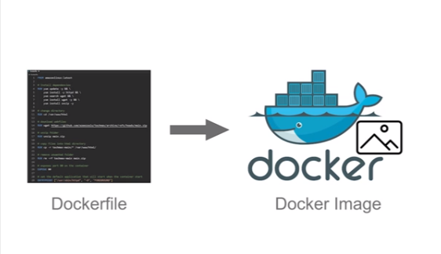

# docker-projects
This is a repository for my docker projects

# Jupiter Web Application

Jupiter is a web application hosted using the Apache HTTP Server on Amazon Linux. This repository provides a Dockerized setup for the application, ensuring consistent deployment across various environments.

## Prerequisites

- [Docker](https://www.docker.com/get-started) installed on your machine.

## Dockerfile Breakdown

- **Base Image**: Uses the latest version of Amazon Linux.
- **Dependencies**: Installs the Apache HTTP Server, `wget` for downloading files, and `unzip` for extracting zip files.
- **Web Files**: Downloads and sets up web files from the `jupiter` repository.
- **Port**: Exposes port 80 for the Apache HTTP Server.
- **Entry Point**: The default application that runs when the container starts is the Apache HTTP Server.

## Getting Started

1. **Create Dockerfile**:

```bash
FROM amazonlinux:latest
RUN yum update -y && \
    yum install -y httpd && \
    yum search wget && \
    yum install wget -y && \
    yum install unzip -y
RUN cd /var/www/html
RUN wget https://github.com/azeezsalu/jupiter/archive/refs/heads/main.zip
RUN unzip main.zip
RUN cp -r jupiter-main/* /var/www/html/
RUN rm -rf jupiter-main main.zip
EXPOSE 80
ENTRYPOINT ["/usr/sbin/httpd", "-D", "FOREGROUND"]
   ```


2. **Build the Docker Image**:

   Navigate to the root directory of the project where the `Dockerfile` is located and run:

   ```bash
   docker build -t jupiter .
      ```

   This will build a Docker image named `jupiter`.

   To view the image just built run this command:

   ```bash
   docker image ls
   ```

3. **Start the Container**:


   
   
   Once the image is built, you can start a container:

   ```bash
   docker run -dp 80:80 jupiter
   ```

   Here we go You have successfully started the container in detached mode, mapping port on your host to port 80 on the container.

   To see your jupiter website, carry out the next step


4. **Access the Application**:

   Open a web browser and type or copy and paste the command in it:

   ```
   http://localhost:80
   ```

   Here We Go! You should now see the Jupiter web application running.


   

5. **Issues**:

   If you encounter any issues, please open an issue on the GitHub repository.
